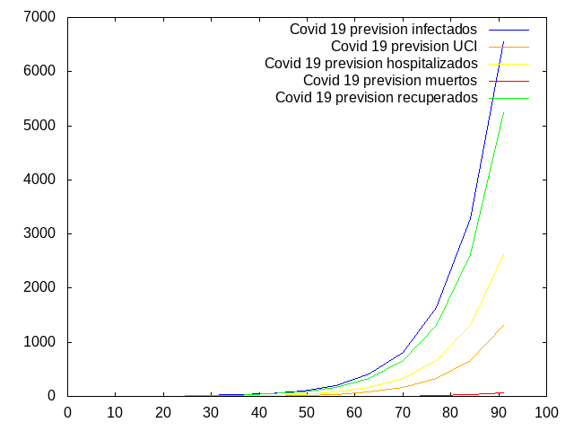

# COVID-19_OSINT
Bienvenidas al:
Grupo de Tarea Conjunta OSINT (Open-source Intelligence) para la investigación y comunicación en torno a la pandemia de SARS-COVID-2/COVID-19.

Búsqueda de información y elaboración de hipótesis. Filtro de noticias y "fake-news". Investigación ciudadana crítica. Colaboración de código libre multidisciplinar.


Evitemos distraer el hilo del grupo con noticias sensacionalistas o discusiones de opinión. Las conspiranoias (http://t.me/COVID19Cowspiranoias) y opiniones excéntricas pueden ayudar a romper la ortodoxia y el discurso dominante, pero no dejemos que el grupo derive hace eso. La política es la gestión de los asuntos públicos por parte de los ciudadanos, pero evitemos politizar los debates en exceso y sobretodo, dentro de los paradigmas partidistas y seguidistas.

Salud !!

Documento colaborativo: https://paper.komun.org/p/covid19-OSINT

Dashboard Coronavirus COVID-19 (Mobile)
https://www.arcgis.com/apps/opsdashboard/index.html#/85320e2ea5424dfaaa75ae62e5c06e61


Herramienta de prediccion 




Uso 


````

runhaskell pandemia.hs --contact_rate 2 --infected_rate 10 --recovered 80 --hospital 40 --danger 20 --cycles 16 --incubation 7


runhaskell pandemia.hs --help
The commandargs program

commandargs [OPTIONS]

Common flags:
     --contact_rate=NUM     Middle number of contacts
     --infected_rate=NUM    Number of infected vs tests realized
     --recovered=NUM        Recovered rate, Infected vs recovered persons
     --hospital=NUM         Hospitalization rate, invected vs hospitalizated
                            persons
     --danger=NUM           Danger rate, infected vs danger state infected
                            people
     --dead=NUM             Dead rate , infected vs dead people
     --cycles=INT           Number of incubation cycles
     --incubation_days=INT  Number of incubation days
     --riots=INT            Riots in time
     --imigration_rate=INT  Rate of imigrants growth
     --pillage=INT          Bandalism rate in shops or authority
                            infrastructures, cases per day
     --street_police=INT    Number of authority forces in the street, police
                            x citizens
  -? --help                 Display help message
  -V --version              Print version information


````


Para windows editar y descomentar la linea de windows y comentar la de linux . 

Dependencias

apt install haskell-platform


Binarios cooming soon
